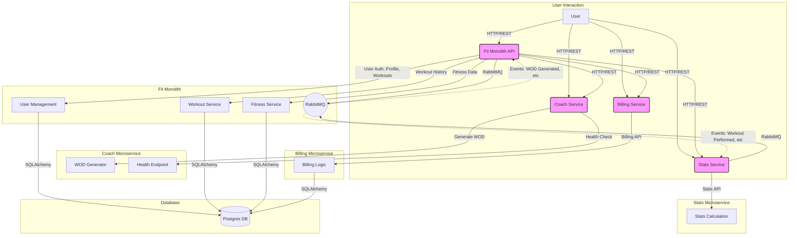

```mermaid
graph TD
    subgraph User Interaction
        A[User] -->|HTTP/REST| B(Fit Monolith API)
        A -->|HTTP/REST| C(Coach Service)
        A -->|HTTP/REST| D(Stats Service)
        A -->|HTTP/REST| E(Billing Service)
    end

    subgraph Fit Monolith
        B -->|User Auth, Profile, Workouts| F[User Management]
        B -->|Workout History| G[Workout Service]
        B -->|Fitness Data| H[Fitness Service]
        B -->|RabbitMQ| I((RabbitMQ))
        B -->|HTTP/REST| C
        B -->|HTTP/REST| D
        B -->|HTTP/REST| E
    end

    subgraph Coach Microservice
        C -->|Generate WOD| J[WOD Generator]
        C -->|Health Check| K[Health Endpoint]
    end

    subgraph Stats Microservice
        D -->|Stats API| L[Stats Calculation]
        D -->|RabbitMQ| I
    end

    subgraph Billing Microservice
        E -->|Billing API| M[Billing Logic]
    end

    subgraph Database
        F -->|SQLAlchemy| N[(Postgres DB)]
        G -->|SQLAlchemy| N
        H -->|SQLAlchemy| N
        M -->|SQLAlchemy| N
    end

    I -.->|Events: Workout Performed, etc| D
    I -.->|Events: WOD Generated, etc| B

    classDef service fill:#f9f,stroke:#333,stroke-width:2px;
    class B,C,D,E service;
```
